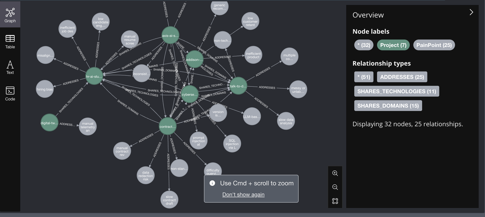
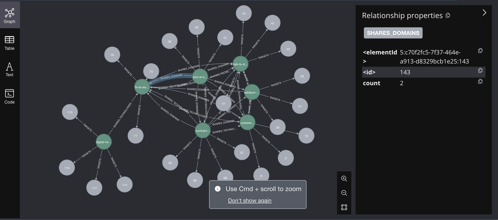
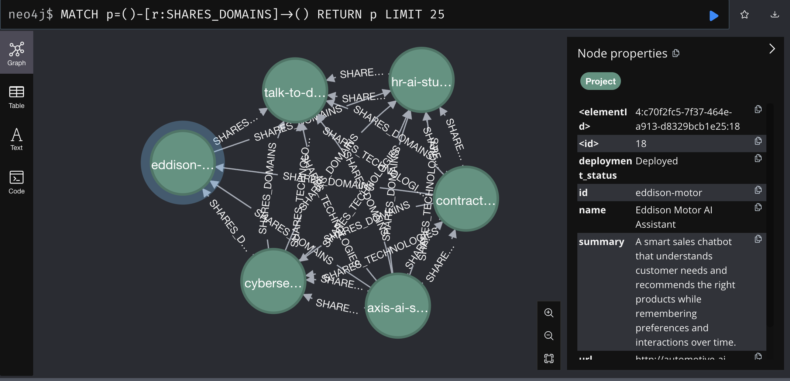

# 🧠 PwC ConsultEdge AI

[](https://www.langchain.com/)
[](https://neo4j.com/)
[](https://openai.com/)
[](https://www.python.org/)
[](https://www.typescriptlang.org/)
[](https://reactjs.org/)
[](https://developer.mozilla.org/en-US/docs/Web/JavaScript)
[](https://tailwindcss.com/)

An intelligent GenAI assistant that acts as a **PwC Technology Consultant**—aware of all team-built GenAI assets—and actively helps in meetings by matching client pain-points with PwC Labs solutions. Built to eliminate manual discovery, augment discussions, and evolve into a full-fledged fine-tuned assistant.




---

## 🧩 Key Modules

| Step                          | Details                                                                                         | Stack Pieces                                                                 |
|-------------------------------|-------------------------------------------------------------------------------------------------|------------------------------------------------------------------------------|
| **Knowledge Graph of PwC Lab Assets** | Nodes = assets; edges = domain → industry → pain‑point solved.                                      | Neo4j or Memgraph, LangChain ingestion script from `assets.json`.           |
| **Live Pain‑Point Capture**  | During call (Teams/Zoom) → stream transcript live or post-meeting upload.                     | Whisper + Twilio Media Streams or Zoom Webhooks                             |
| **RAG‑Based Matching**       | For each transcript chunk, call GPT‑4o with KG retriever: “Which assets solve _detected pain_?” | LangChain KG-Retriever → Top‑k nodes → GPT-4 for justification              |
| **Consultant Dashboard**     | Timeline of meeting + asset-fit suggestions.                                                   | Next.js + ReactFlow for graph view, Shadcn UI for clean interaction         |
| **Analytics**                | Post-call stats: sentiment, asset interest score, follow-up signals.                          | OpenAI NLP + Supabase for logs + Recharts for visualization                 |

---

## 🚀 Features (Planned)

- 📚 **PwC Asset Knowledge Graph**: Ingest all Labs projects into an interactive Neo4j database.
- 🤖 **GPT-4-Powered Asset Advisor**: Ask natural language questions like _"Which projects solve hiring bias?"_
- 🧠 **Meeting Awareness (Planned)**: In future, the agent will listen in real-time and suggest assets contextually.
- 📊 **Analytics Dashboard (Planned)**: Auto-capture sentiment, asset popularity, follow-up actions, and trends.



---

## 📂 Project Structure

```

backend/
├── graph.py               # Ingests JSON and creates graph
├── qa\_agent.py            # Natural language QA on the graph
├── assets.json            # PwC Labs projects metadata
├── .env                   # API keys for OpenAI & Neo4j
├── requirements.txt

````

---

## 🧠 Sample Queries

- “Which assets address hiring bias?”
- “What tools can be used in industrial automation?”
- “Show projects aligned with GDPR and HIPAA”
- “Which AI apps are built for contract redaction?”

---

## ⚙️ Setup Instructions

### Clone + Install

```bash
git clone https://github.com/Aytaditya/pwc_hackathon.git
cd pwc-genai-consultant
pip install -r requirements.txt
````

### Add Environment Variables

Create a `.env` file:

```env
OPENAI_API_KEY=sk-...
NEO4J_URL=bolt://localhost:7687
NEO4J_USERNAME=neo4j
NEO4J_PASSWORD=test1234
```

### Ingest Graph

```bash
python graph.py
```

### Run QA Demo

```bash
python qa_agent.py
```

---

## System Architecture

```mermaid
graph TD
    A[Assets JSON / Confluence] -->|LLM Extraction| B(Graph Ingestion Script)
    B --> C{Neo4j Knowledge Graph}

    subgraph Meeting Flow
        D[Transcript (live or upload)] --> E[Whisper (STT)]
        E --> F[Chunk & Detect Pain Points]
        F --> G[RAG + KG Matching → GPT-4o]
        G --> H[Suggested Assets]
    end

    C --> G
    H --> I[Frontend Dashboard]
```

---

## Analytics Features (Planned)

* Most Frequently Recommended Assets
* Client Sentiment During Call
* Follow-up Notes from Agent
* Tag Asset Interest Level Automatically



---

## Access Control (Planned)

* Role-based control (Partner, Analyst, Intern)
* Asset visibility based on vertical
* Slack/Teams integration for asset querying

---

## 🤖 Vision

A virtual technology consultant that:

* Knows everything your team builds 💡
* Speaks in natural language 🤝
* Guides you with matching AI tools during real-time client meetings 🧠
* Can be fine-tuned with past engagements for personalization 🎯

---

## 🛡️ License

© 2024 PwC Digital Products and Transformation Team. Internal Use Only.

---

## 🙋‍♀️ Contributing

Want to expand the ingestion capabilities, integrate transcripts, or add frontend dashboards? Open a PR or reach out via Teams.

---
